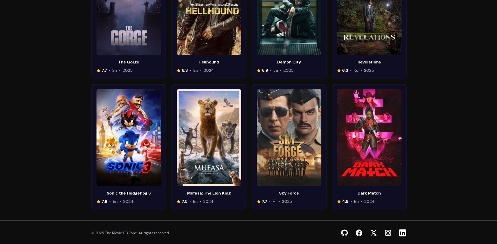
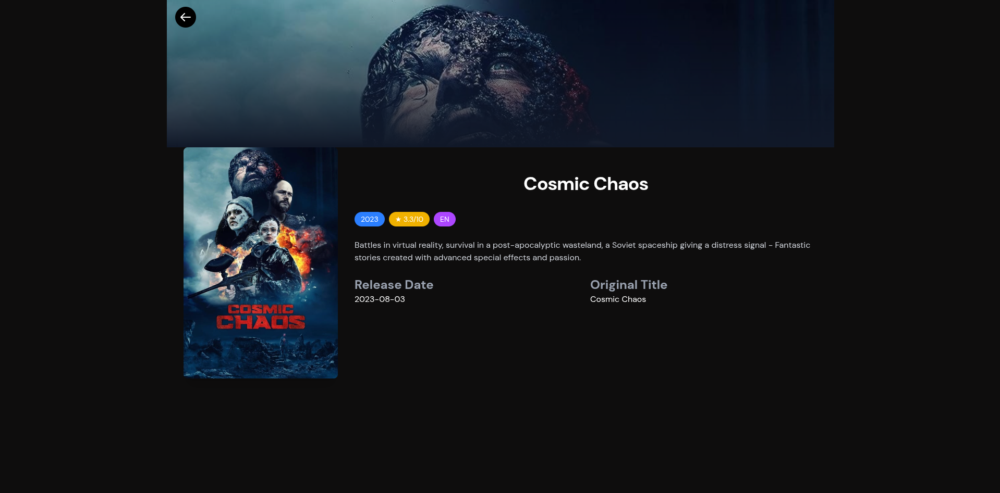
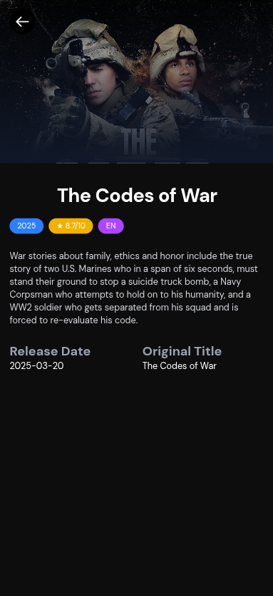

# TMDBVerse-React-TailwindCSS-Frontend
This is the frontend of The MovieDB Verse project, it contains a beautiful UI, and integration with the [backend repository](https://github.com/A4GOD-AMHG/TMDBVerse-Go-Fiber-Redis-Backend.git)

## Tech Stack

<div style="display: flex; align-items: center;">
  
    
   
</div>

## Features

- Beautiful UI and Design
- Fully Responsive
- Navigation between pages with **React Router**
- Search functionality
- Real-time data fetching  
- Complete integration with the [Go Fiber Backend](https://github.com/A4GOD-AMHG/TMDBVerse-Go-Fiber-Redis-Backend.git)
- Single-command setup with `docker-compose` with a pre-configured Redis service

## How to Use

1. **Clone the repository**:

```bash
   git clone https://github.com/A4GOD-AMHG/TMDBVerse-React-TailwindCSS-Frontend

   cd TMDBVerse-React-TailwindCSS-Frontend
```

2. **Configure environment variables:**

- Change name of the example environment file example.env to .env:

- Edit the .env file with your credentials:

```bash
VITE_GO_FIBER_BACKEND=:http://localhost:8080/
```

3. **Launch the application:**

```bash
docker-compose up --build
```

## Backend Setup

For the Go Fiber backend implementation, please go to the [TMDBVerse-Go-Fiber-Redis-Backend](https://github.com/A4GOD-AMHG/TMDBVerse-Go-Fiber-Redis-Backend.git)


## Screenshots










## Author

- Alexis Manuel Hurtado García (<https://github.com/A4GOD-AMHG>)
  